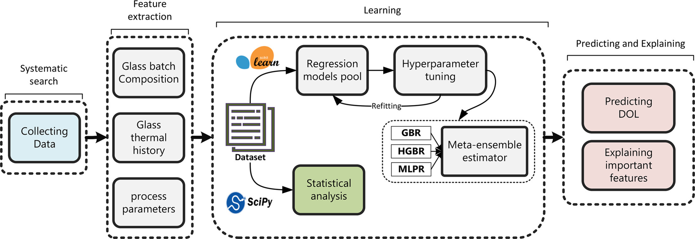

# Depth Of Layer Predictor Apparatus

Depth Of Layer Predictor Apparatus (DOLPA) is a set of machine learning regressor models trained to predict the ‘depth of layer’ (DOL) in ion-exchangeable glasses based on the physical and chemical properties used in experimental setups.

Ion exchange is a process that alters the chemical composition and mechanical properties of glass by replacing some of the ions in the glass with different ions from a molten salt bath.
The process involves immersing the glass in a molten salt solution, where larger ions from the salt replace smaller ions in the glass surface. This creates a layer of compressive stress that makes the glass more resistant to cracks and scratches.
Ion exchange can modify the physical and optical properties of the glass, such as its strength, refractive index, color, and transparency. Ion-exchangeable glasses are often used for applications that require high performance and durability, such as touch screens, optical amplifiers, lasers, and sensors.

The depth of layer (DOL) in ion-exchangeable glasses is a measure of how deep the glass surface is modified by a process of ion exchange, which involves swapping smaller ions in the glass with larger ions from a salt or a solution. The ion exchange can enhance the strength, durability, and optical properties of the glass by creating a compressive stress layer and altering the refractive index of the glass. The depth of layer depends on several factors, such as the composition of the glass, the type and concentration of the salt or solution, and the duration and temperature of the ion exchange process. Typically, the depth of layer ranges from 20 to 150 microns, depending on the desired effect and application of the ion-exchangeable glass.

(All credits belong to [SAXON GLASS](https://saxonglass.com/))

This repository contains the full implementation of DOLPA and the replication packages including comprehensive DOL datasets and various machine-learning experiments with manipulated parameters.  

## Project contributors
* **Omid Banapour Ghaffaria** 
  * Ph.D. Candidate, School of Metallurgy and Materials Engineering, Iran University of Science and Technology
  * Email: **omid_banapour[at]metaleng.iust.ac.ir** 

* **Bijan Eftekhari Yekta** 
  * Professor, School of Metallurgy and Materials Engineering, Iran University of Science and Technology
  * Email: **Beftekhari[at]iust.ac.ir**

* **Morteza Zakeri-Nasrabadi** 
  * Postdoctoral Researcher, School of Computer Science, Institute for Research in Fundamental Sciences (IPM),  Farmanieh Campus, No. 70, next to Kouhe Nour Building, Lavasani Av. Tehran, Iran. P. O. Box: 19395-5746 
  * Email: **zakeri[at]ipm.ir**

## News 
**Release date:** The full implementation of the tool will be available at this repository ([https://github.com/m-zakeri/DOLPA](https://github.com/m-zakeri/DOLPA)) after our relevant papers are accepted for publication.

## Publications
[1] Banapour Ghaffari, O., B. Eftekhari Yekta, and M. Zakeri-Nasrabadi, Estimating “depth of layer” (DOL) in ion-exchanged glasses using explainable machine learning. Materialia, 2024. 33: p. 102027.[https://doi.org/10.1016/J.MTLA.2024.102027](https://doi.org/10.1016/J.MTLA.2024.102027)
						
[2] Banapour Ghaffari, O., B. Eftekhari Yekta, and M. Zakeri-Nasrabadi, Designing High-Performance Ion-Exchangeable Glasses with Multi-Objective Optimization and Machine Learning. Ceramics International, 2024.[https://doi.org/10.1016/j.ceramint.2024.08.141](https://doi.org/10.1016/j.ceramint.2024.08.141)

**ABSTRACT** 

The process of ion exchange includes the substitution of a larger ion for a smaller ion, which frequently takes place at temperatures lower than the glass transition temperature. The crucial variables in this particular procedure are the depth of layer (DOL) and the surface compressive stress (CS). Determining the best composition for ion-exchangeable glasses is an intricate task that is impeded by conflicting demands. Traditional experimental and empirical discovery methods are challenging, expensive, and time-consuming. This paper presents a machine learning model to understand the effects of many factors, such as chemical compositions, temperature, process time, ion source, and electrical field strength, on the DOL. A dataset of ion-exchangeable glasses is acquired by extracting the data from academic research articles and patents. The proposed dataset contains 265 unique samples, each characterized by 22 parameters that are employed as learning features. A meta-estimator called a voting regressor, which performs better than individual models, is presented using the three best-performing models as inputs. The R2 score of the DOL prediction model is 0.8841. The proposed model was interpreted by computing the Shapley additive explanations (SHAP) values of the ion exchange process variables as well as the chemical composition of the glass. The enhancement of the DOL value was found to be highly influenced by the ion exchange process parameters, such as duration, temperature, and electric field intensity, as well as the compositions of Si2O, Na2O, and Li2O. In contrast, the DOL value decreases with an increase in Tg, Al2O3, MgO, CaO, K2O, TiO2, and B2O3.

(read more on our [Webpage](http://webpages.iust.ac.ir/omid_banapour/EF-IE.html))

## FQA
You may ask any question by contacting m-zakeri@live.com.

